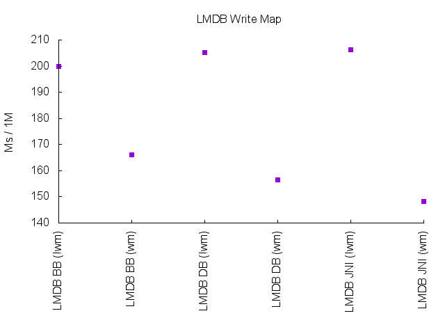
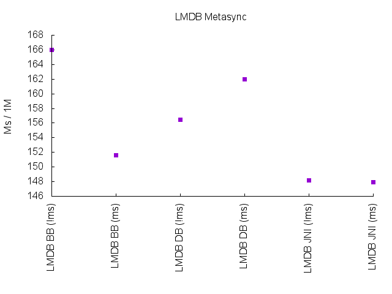
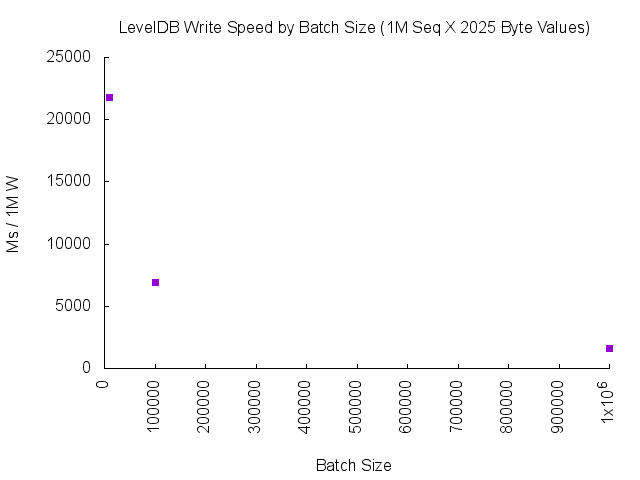
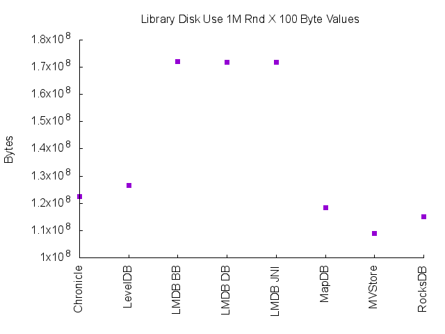
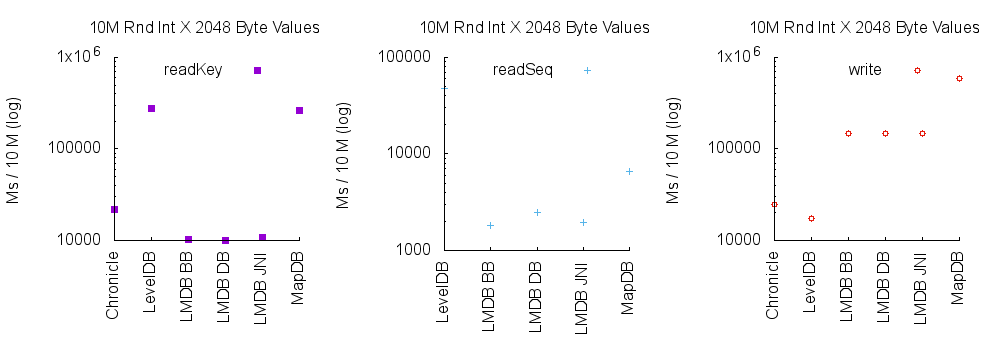

## Introduction
[LmdbJava Benchmarks](https://github.com/lmdbjava/benchmarks) revision 55afd0
was executed on 30 June 2016. The versions of libraries were as specified in
the POM and reflect the latest Maven Central releases at the time. LmdbJava
was tested using commit 3b21c2 and `liblmdb.so` 0.9.18.

The test used memory-sized workloads. The test server had 512 GB RAM and 2 x
Intel Xeon E5-2667 v 3 CPUs. It was running Linux 4.5.4 (x86_64) with Java
1.8.0_92.

Raw CSV, TXT and DAT output files from the execution are available in the
same GitHub directory as this README and images. The scripts uses to execute
the benchmark and generate the output files are also in the results directory.

## Test 1: LMDB Implementation Settings
To ensure appropriate LMDB defaults are used for the remainder of the benchmark,
several key LMDB settings were benchmarked.

These benchmarks all used 1 million sequential integer keys X 100 byte values.

LmdbJava supports several buffer types, including Agrona `MutableDirectBuffer`
and Java's `ByteBuffer` (BB). The BB can be used in a safe mode or an
`Unsafe`-based mode. The latter is the default. The above graph illustrates a
consistent penalty when forcing safe mode to be used, as would be expected.
`Unsafe` BB is therefore used for LmdbJava in the remainder of the benchmark.

The above graph shows the impact of the LMDB Env `MDB_NOSYNC` flag. As expected,
requiring a sync is consistently slower than not requiring it. Forced syncs are
disabled for the remainder of the benchmark.

LMDB also supports a `MDB_WRITEMAP` flag, which enables a writable memory map.
Enabling the write map (shown as `(wm)` above) results in improved write
latencies. It remains enabled for the remainder of the benchmark.

This final LMDB-specific benchmark explores the write latency impact of the
`MDB_NOMETASYNC` flag. This flag prevents an fsync metapage after commit. Given
the results are inconclusive across different buffer types, it will be disabled
for the remainder of the benchmark.

## Test 2: Determine ~2,000 Byte Value
Some of the later tests require larger value sizes in order to explore the
behaviour at higher memory workloads. This second benchmark was therefore
focused on finding a reasonable ~2,000 byte value. Only the native libraries
were benchmarked.

This benchmark used 1 million non-sequential integer keys X ~2,000 byte values.
Non-sequential keys were used because these resulted in larger sizes.

As shown, LevelDB and RocksDB achieve consistent storage of these 1 million
entries. LMDB requires more storage for all value sizes, but there is a material
degradation above 2,025 bytes. As such 2,025 bytes will be used in the future.
It is noted that an LMDB copy with free space compaction was also performed, but
this did not achieve any material improvement.

## Test 3: LevelDB Batch Size
LevelDB is able to insert data in batches. To give LevelDB the best chance of
performing well, test 3 explored its optimal batch size when inserting 1 million
sequential integer keys X 2,025 byte values.

As shown, LevelDB write latency is lowest when the batch size is as large as
possible. For the remaining benchmarks, the same batch size will be used as the
number of entries (ie 1 million).

## Test 4: 1 Million X 100 Byte Values
Now that appropriate settings have been verified, this is the first test of all
libraries. In all of these benchmarks we are inserting 1 million entries. The
vertical (y) axis uses a log scale given the major performance differences
between the fastest and slowest libraries.

In the benchmarks below, Chroncile is only benchmarked for the `readKey` and
`write` workloads. This is because Chroncile does not provide an ordered key
iterator, and such an iterator is required for the remaining benchmark methods.

We begin by exploring the resulting disk space consumed by the memory-mapped
files when keys are inserted in random order. This is the true bytes consumed by
the directory (as calculated by a POSIX C `stat` call and similar tools like
`du`), and is not simply the "apparent size". The graph shows what we saw
earlier, namely that LMDB requires more storage than the other libraries.

We start with the most mechanically sympathetic workload. If you have integer
keys and can insert them in sequential order, the above graphs illustrate the
type of latencies achievable across the various libraries. LMDB is clearly the
fastest option, even including writes.

Here we simply run the same benchmark as before, but with string keys instead
of integer keys. Our string keys are the same integers as our last benchmark,
but this time they are recorded as a zero-padded string. LMDB continues to
perform better than any alternative, including for writes.

Next up we farewell mechanical sympathy and apply some random workloads. Here
we write the keys our in random order, and we read them back (the `readKey`
benchmark) in that same random order. The remaining operations are all cursors
over the sequential keys. The graphs show LMDB is consistently faster for all
operations, with the one exception being writes (where LevelDB is much faster).

This benchmark is the same as the previous, except with our zero-padded string
keys. There are no surprises; we see the same results as reported above.

## Test 5: 10 Million X 2,025 Byte Values
In our final test we burden the implementations with a more aggressive in-memory
workload to see how they perform. We store 10 million entries with 2,025 byte
keys, which is roughly 19 GB RAM before library overhead.

It was hoped all implementations above could be tested. However:

* MvStore crashed with "java.lang.OutOfMemoryError: Capacity: 2147483647"
* RocksDB crashed with "too many open files" (`lsof` reported > 144,000)

Given test 4 showed the integer and string keys perform effectively the same,
to reduce execution time this test only included the integer keys. A logarithmic
scale continues to be used for the horizontal (y) axis.

Starting with the most optimistic scenario of sequential keys, we see LMDB
out-perform the alternatives in all cases except writes. Chroncile's write
performance is good, but it should be remembered that it is not maintaining an
index suitable for ordered key iteration.

Finally, with random access patterns we the same pattern as all our other
benchmarks: LMDB is the fastest for everything except reads.

## Conclusion
For read-heavy workloads, LmdbJava offers the lowest latency solution available
on Java today. Its two main trade-offs are larger memory mapped files and slower
writes. While LevelDB provides superior write performance, this outcome is
heavily dependent on large batch sizes.