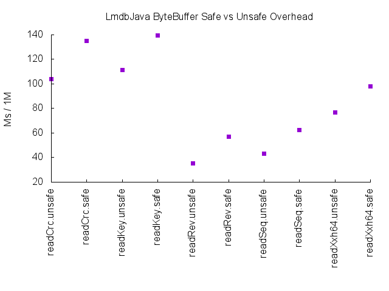
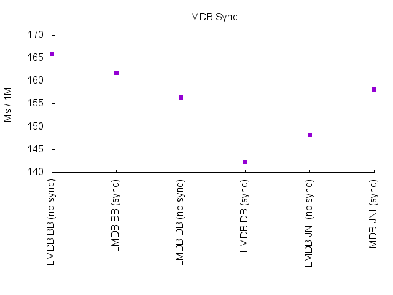
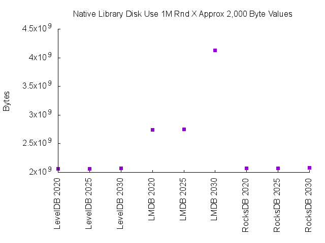
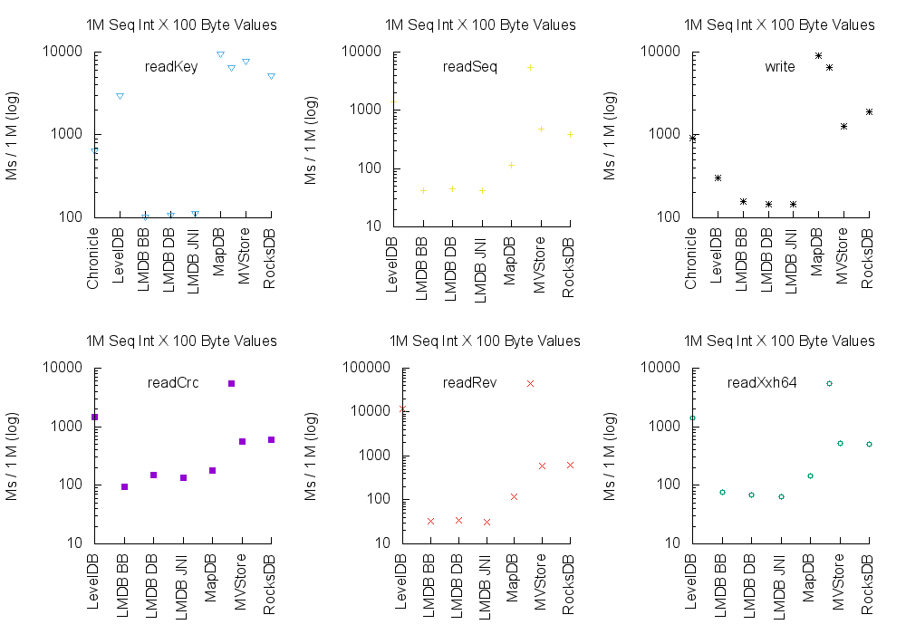
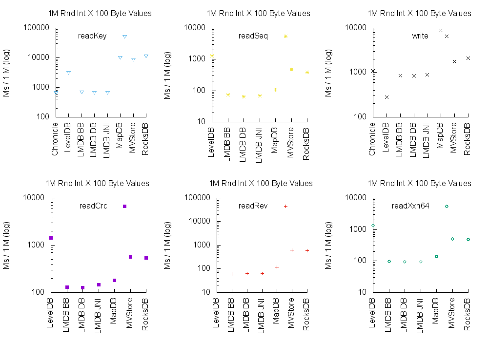
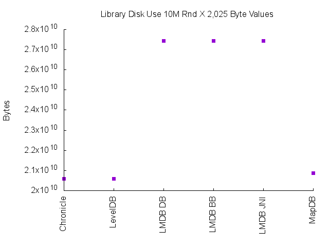
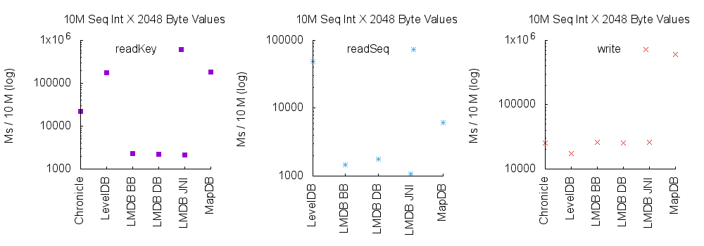

## Introduction
[LmdbJava Benchmarks](https://github.com/lmdbjava/benchmarks) revision 55afd0
was executed on 30 June 2016. The versions of libraries were as specified in
the POM and reflect the latest Maven Central releases at the time. LmdbJava
was tested using commit 3b21c2 and `liblmdb.so` 0.9.18.

The test used memory-sized workloads. The test server had 512 GB RAM and 2 x
Intel Xeon E5-2667 v 3 CPUs. It was running Linux 4.5.4 (x86_64) with Java
1.8.0_92.

To make the graphs and discussion smaller, the follow terms are used:

* Chroncile: [Chroncile Map](https://github.com/OpenHFT/Chronicle-Map)
* Int: 32-bit signed integer (using the implementation's default byte ordering)
* LevelDB: [LevelDBJNI](https://github.com/fusesource/leveldbjni)
* LMDB BB: [LmdbJava](https://github.com/lmdbjava/lmdbjava) with a Java-based
  `ByteBuffer` (via `PROXY_OPTIMAL`)
* LMDB DB: [LmdbJava](https://github.com/lmdbjava/lmdbjava) with an Agrona-based
  `DirectBuffer`
* LMDB JNI: [LMDBJNI](https://github.com/deephacks/lmdbjni) with its included,
  `Unsafe`-based `DirectBuffer`
* M: Million
* MapDB: [MapDB](http://www.mapdb.org/)
* Ms: Milliseconds
* MVStore: [MVStore](http://h2database.com/html/mvstore.html)
* readCrc: Iterate over ordered entries, computing a CRC32 of all keys and values
* readSeq: Iterate over ordered entries, consuming each value into the black hole
* readRev: Same as readSeq, except operating in reverse order over the entries
* readXxh64: Same as readCrc, except computing an XXH64 via
  [Zero-Allocation-Hashing](https://github.com/OpenHFT/Zero-Allocation-Hashing)
  (ZAH XXH64 is currently the fastest JVM hasher, as separately benchmarked via
  [Hash-Bench](https://github.com/benalexau/hash-bench))
* RocksDB: [RocksDB](http://rocksdb.org/)
* Rnd: Random data access (ie integers ordered via a Mersenne Twister)
* Seq: Sequential data access (ie ordered integers from 0 to 1M/10M)
* Str: 16 byte string containing a zero-padded integer (no length prefix or null
  terminator)
* write: Write the 1M/10M entries out in an implementation-optimal manner (eg
  via a single transaction or batch mode if supported)

Raw CSV, TXT and DAT output files from the execution are available in the
same GitHub directory as this README and images. The scripts used to execute
the benchmark and generate the output files are also in the results directory.

## Test 1: LMDB Implementation Settings
To ensure appropriate LMDB defaults are used for the remainder of the benchmark,
several key LmdbJava and LMDB settings were benchmarked.

These benchmarks all used 1 million sequential integer keys X 100 byte values.

### Force Safe

LmdbJava supports several buffer types, including Agrona `DirectBuffer`
and Java's `ByteBuffer` (BB). The BB can be used in a safe mode or an
`Unsafe`-based mode. The latter is the default. The above graph illustrates a
consistent penalty when forcing safe mode to be used, as would be expected.
`Unsafe` BB is therefore used for LmdbJava in the remainder of the benchmark.

### Sync

The above graph shows the impact of the LMDB Env `MDB_NOSYNC` flag. As expected,
requiring a sync is consistently slower than not requiring it. Forced syncs are
disabled for the remainder of the benchmark.

### Write Map

LMDB also supports a `MDB_WRITEMAP` flag, which enables a writable memory map.
Enabling the write map (shown as `(wm)` above) results in improved write
latencies. It remains enabled for the remainder of the benchmark.

### Meta Sync

This final LMDB-specific benchmark explores the write latency impact of the
`MDB_NOMETASYNC` flag. This flag prevents an fsync metapage after commit. Given
the results are inconclusive across different buffer types, it will be disabled
for the remainder of the benchmark.

## Test 2: Determine ~2,000 Byte Value
Some of the later tests require larger value sizes in order to explore the
behaviour at higher memory workloads. This second benchmark was therefore
focused on finding a reasonable ~2,000 byte value. Only the native libraries
were benchmarked.

This benchmark used 1 million non-sequential integer keys X ~2,000 byte values.
Non-sequential keys were used because these resulted in larger sizes.

As shown, LevelDB and RocksDB achieve consistent storage of these 1 million
entries. LMDB requires more storage for all value sizes, but there is a material
degradation above 2,025 bytes. As such 2,025 bytes will be used in the future.
It is noted that an LMDB copy with free space compaction was also performed, but
this did not achieve any material improvement.

## Test 3: LevelDB Batch Size
LevelDB is able to insert data in batches. To give LevelDB the best chance of
performing well, test 3 explored its optimal batch size when inserting 1 million
sequential integer keys X 2,025 byte values.

As shown, LevelDB write latency is lowest when the batch size is as large as
possible. For the remaining benchmarks, the same batch size will be used as the
number of entries (ie 1 or 10 million).

## Test 4: 1 Million X 100 Byte Values
Now that appropriate settings have been verified, this is the first test of all
libraries. In all of these benchmarks we are inserting 1 million entries. The
vertical (y) axis uses a log scale given the major performance differences
between the fastest and slowest libraries.

In the benchmarks below, Chroncile Map is only benchmarked for the `readKey` and
`write` workloads. This is because Chroncile Map does not provide an ordered key
iterator, and such an iterator is required for the remaining benchmark methods.

### Storage Use

We begin by exploring the resulting disk space consumed by the memory-mapped
files when integer keys are inserted in random order. This reflects the actual
bytes consumed by the directory (as calculated by a POSIX C `stat` call and
tools like `du`). It is not simply the "apparent size". The graph shows what we
saw earlier, namely that LMDB requires more storage than the other libraries.

The actual data without overhead should be 1M X (100 byte value + 4 byte key),
or 104,000,000 bytes. Here we see the most efficient implementation (MVStore)
requires 108,933,120 bytes (~5% overhead) and the least efficient implementation
(LMDB) requires 172,040,192 bytes (~65% overhead). This overhead reflects LMDB's
[B+ tree](https://en.wikipedia.org/wiki/B%2B_tree) layout (with associated read
latency advantages, as will be reported below) and also its
[copy-on-write](https://en.wikipedia.org/wiki/Copy-on-write) page allocation
approach. The latter delivers significant programming model and operational
benefits such as fully ACID transactions, zero copy buffer use, single file
storage, journal-free operation, no requirement to carefully tune the setup
based on data sizes (although value sizing is important, as reported in test 2
above).

### 99 MB Sequential Access (Integers)

We start with the most mechanically sympathetic workload. If you have integer
keys and can insert them in sequential order, the above graphs illustrate the
type of latencies achievable across the various libraries. LMDB is clearly the
fastest option, even including writes.

### 110 MB Sequential Access (String)

Here we simply run the same benchmark as before, but with string keys instead
of integer keys. Our string keys are the same integers as our last benchmark,
but this time they are recorded as a zero-padded string. LMDB continues to
perform better than any alternative, including for writes.

### 99 MB Random Access (Integers)

Next up we farewell mechanical sympathy and apply some random workloads. Here
we write the keys out in random order, and we read them back (the `readKey`
benchmark) in that same random order. The remaining operations are all cursors
over sequentially-ordered keys. The graphs show LMDB is consistently faster for
all operations, with the one exception being writes (where LevelDB is much
faster).

### 110 MB Random Access (Strings)

This benchmark is the same as the previous, except with our zero-padded string
keys. There are no surprises; we see the same results as reported immediately
above.

## Test 5: 10 Million X 2,025 Byte Values
In our final test we burden the implementations with a more aggressive in-memory
workload to see how they perform. We store 10 million entries with 2,025 byte
keys, which is roughly 19 GB RAM before library overhead.

It was hoped all implementations above could be tested. However:

* MvStore crashed with "java.lang.OutOfMemoryError: Capacity: 2147483647"
* RocksDB crashed with "too many open files" (`lsof` reported > 144,000)

Given test 4 showed the integer and string keys perform effectively the same,
to reduce execution time this test only included the integer keys. A logarithmic
scale continues to be used for the vertical (y) axis.

### Storage Use

As with test 4, we begin by reviewing the actual disk space consumed by the
memory-mapped files. The above graph shows the larger, random ordered use case.
The actual data without overhead should be 10M X (2,025 byte value + 4 byte key)
or 20,290,000,000 bytes. The actual byte values and respective overheads are:

| Implementation | Bytes          | Overhead % |
| -------------- | -------------- | ---------- |
| (as array)     | 20,290,000,000 |        N/A |
| Chronicle      | 20,576,509,952 |        1.4 |
| LevelDB        | 20,592,087,040 |        1.4 |
| LMDB DB        | 27,449,520,128 |       35.2 |
| LMDB BB        | 27,438,403,584 |       35.2 |
| LMDB JNI       | 27,447,676,928 |       35.2 |
| MapDB          | 20,879,245,312 |       10.2 |

### 19 GB Sequential Access

Starting with the most optimistic scenario of sequential keys, we see LMDB
out-perform the alternatives in all cases except writes. Chroncile Map's write
performance is good, but it should be remembered that it is not maintaining an
index suitable for ordered key iteration.

In terms of actual numbers (actual LMDB-specific winner within JMH error range):

| Benchmark          | Ms/Op  | Difference |
| ------------------ | ------ | ---------- |
| readKey.Chronicle  |  22208 | X 10       |
| readKey.LevelDB    | 175465 | X 81       |
| readKey.LMDB BB    |   2258 | Fastest    |
| readKey.LMDB DB    |   2215 | Fastest    |
| readKey.LMDB JNI   |   2150 | Fastest    |
| readKey.MapDB      | 182014 | X 171      |
| readSeq.LevelDB    |  48481 | X 45       |
| readSeq.LMDB BB    |   1458 | Fastest    |
| readSeq.LMDB DB    |   1784 | Fastest    |
| readSeq.LMDB JNI   |   1061 | Fastest    |
| readSeq.MapDB      |   6135 | X 6        |
| write.Chronicle    |  25122 | X 1.45     |
| write.LevelDB      |  17272 | Fastest    |
| write.LMDB BB      |  25756 | X 1.49     |
| write.LMDB DB      |  25668 | X 1.48     |
| write.LMDB JNI     |  26021 | X 1.50     |
| write.MapDB        | 604236 | X 35       |

### 19 GB Random Access

Finally, with random access patterns we see the same pattern as all our other
benchmarks: LMDB is the fastest for everything except writes. In terms of
actual numbers:

| Benchmark          | Ms/Op   | Difference |
| ------------------ | ------- | ---------- |
| readKey.Chronicle  |   22091 | X 2        |
| readKey.LevelDB    |  278030 | X 27       |
| readKey.LMDB BB    |   10330 | Fastest    |
| readKey.LMDB DB    |   10041 | Fastest    |
| readKey.LMDB JNI   |   10657 | Fastest    |
| readKey.MapDB      |  260614 | X 26       |
| readSeq.LevelDB    |   47919 | X 27       |
| readSeq.LMDB BB    |    1815 | Fastest    |
| readSeq.LMDB DB    |    2464 | Fastest    |
| readSeq.LMDB JNI   |    1952 | Fastest    |
| readSeq.MapDB      |    6618 | X 3.6      |
| write.Chronicle    |   24753 | X 1.42     |
| write.LevelDB      |   17331 | Fastest    |
| write.LMDB BB      |  147939 | X 8.54     |
| write.LMDB DB      |  148238 | X 8.56     |
| write.LMDB JNI     |  149345 | X 8.62     |
| write.MapDB        |  588966 | X 33.98    |

## Conclusion
LmdbJava offers an excellent option for read-heavy workloads. The fastest
broadly-equivalent alternative is LevelDB, which is 27 to 81 times slower for
read workloads. On the other hand, LevelDB is more space efficient disk (1.4%
overhead versus 35.2% overhead) and offers superior write performance (with
LmdbJava being ~1.5 to 8.5 times slower).

Prospective LmdbJava users can achieve optimal storage efficiency by reviewing
the size of their key + value combination, in a similar manner to test 2. Value
compression can also be considered, and this may also increase read performance
for primarily sequential read workloads and/or SSD-hosted random read workloads
(as CPU decompression is likely faster than the IO subsystem's read throughput,
although techniques such as striping can also assist in such situations). Two
modern compression libraries recommended for Java users are:

* [LZ4-Java](https://github.com/jpountz/lz4-java): for general cases (LZ77)
* [JavaFastPFOR](https://github.com/lemire/JavaFastPFOR): for integers
